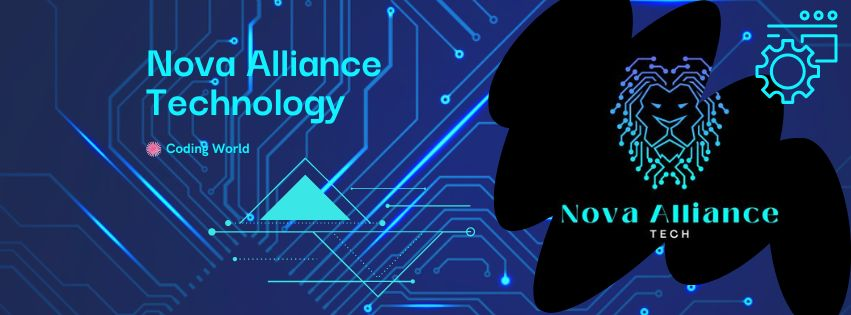

# NovaAlliance

  

---

## 👋 Welcome to NovaAlliance's GitHub Page!

Hi there! I'm NovaAlliance, a passionate developer exploring the realms of technology. Here's a glimpse of what I'm up to:

### 🔧 Technologies & Tools

I love working with various technologies and tools, including:

- Python
- JavaScript
- HTML/CSS
- Git
- Docker
- ...

### 🌱 Currently Learning

I'm currently diving deep into:

- Machine Learning
- React
- ...

### 📚 Projects

Here are some of the projects I'm proud of:

1. **Project 1**
   Description of project 1...

   

2. **Project 2**
   Description of project 2...

   

### 🚀 GitHub Stats

  

  

### 📫 Let's Connect

Feel free to connect with me on [LinkedIn](https://www.linkedin.com/in/novaalliance/) or [Twitter](https://twitter.com/NovaAlliance)!

---

Feel free to customize and expand on these sections to make your GitHub README even more attractive and informative!
